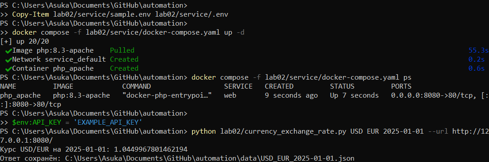

# Отчёт по лабораторной работе № 2

## Цель работы

Освоить обращение к Web API из Python, передачу параметров командной строки, сохранение JSON и обработку ошибок.

## Выполнение

В рабочей копии репозитория `automation` использована ветка `lab02`. В каталоге `lab02` создан скрипт `currency_exchange_rate.py` и README. Приложенный сервис собран в каталог `lab02/service` без изменения PHP-кода и набора данных.

## Методика и результаты проверки

Скрипт запускался отдельными процессами из каталога, отличного от корня репозитория. Проверялись коды завершения и наличие выходных данных. Для пяти дат с шагом 30 дней значения ответа дополнительно сверены с вычислением по исходному `data.json` и формуле приложенного сервера.

Выполнено 16 проверок:

- пять успешных запросов USD/EUR: 2025-01-01, 2025-01-31, 2025-03-02, 2025-04-01, 2025-05-01;
- успешный запрос EUR/MDL на верхней границе периода 2025-09-15;
- успешная нормализация строчных кодов валют;
- успешный запрос USD/USD;
- отклонение неизвестной валюты;
- отклонение несуществующей даты 2025-02-30;
- отклонение даты за пределами периода;
- обработка неверного ключа API;
- обработка отсутствующего ключа API;
- обработка серверной ошибки для RUS;
- обработка недоступного адреса сервиса;
- обработка отсутствующих позиционных аргументов.

Все 16 проверок завершились с ожидаемыми кодами. Успешные запросы создали семь JSON-файлов: повторный запрос в нижнем регистре перезаписал тот же файл USD/EUR. Ошибки записаны в корневой `error.log`; дополнительно проверено отсутствие ключей API в журнале. Подробный протокол находится в `результаты_проверки.json`.

Пример запуска и использования:

## Вывод

Реализовано получение данных через HTTP POST с параметрами URL, проверка ответа, сохранение JSON и журналирование ошибок. Скрипт не зависит от сторонних Python-библиотек. Проверки подтвердили работу с пятью равноотстоящими датами и обработку основных ошибочных ситуаций.